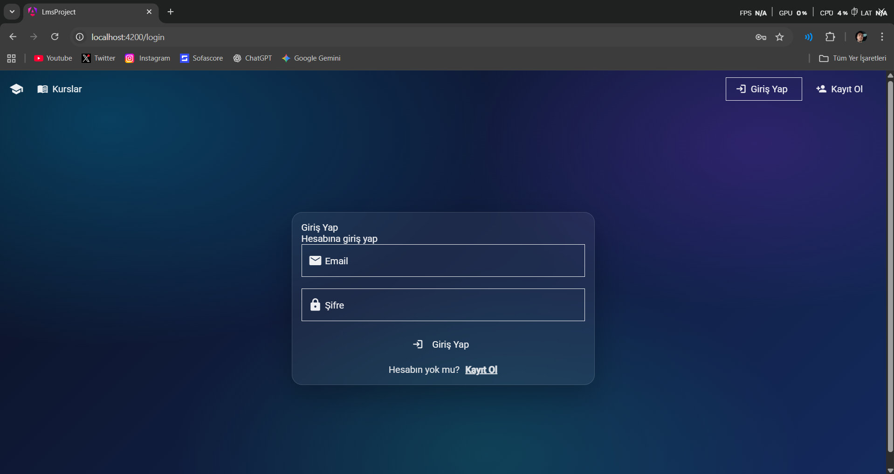
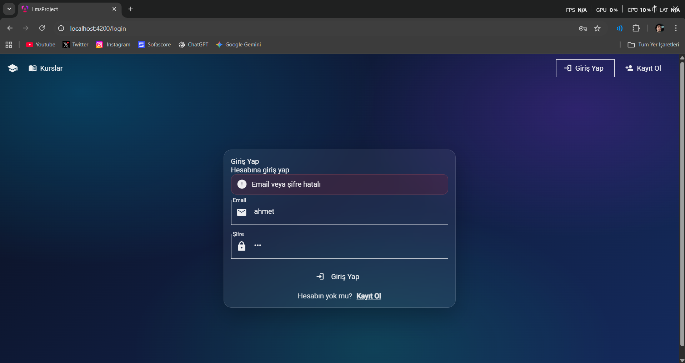
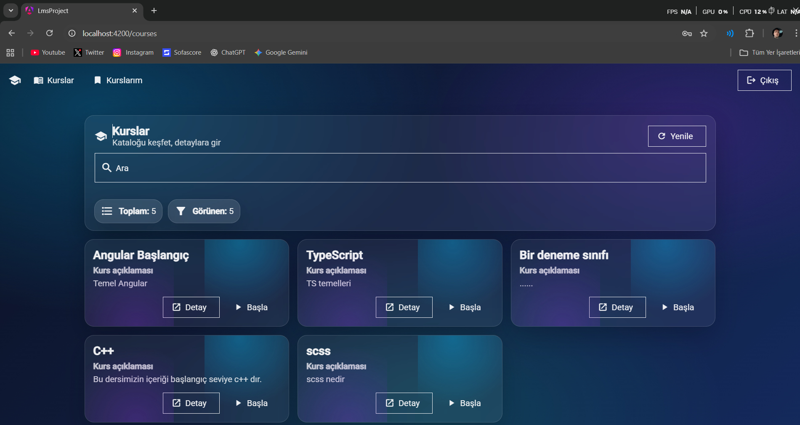
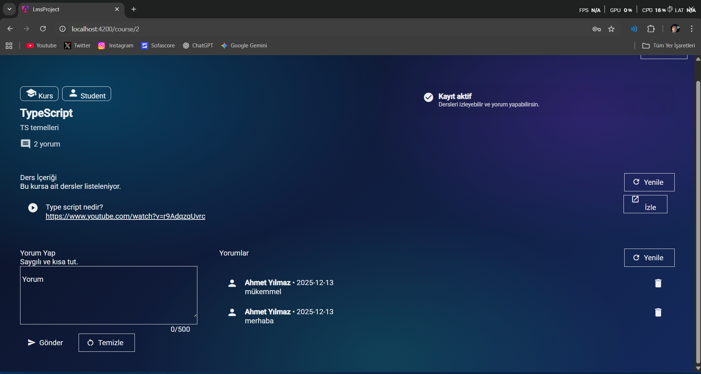
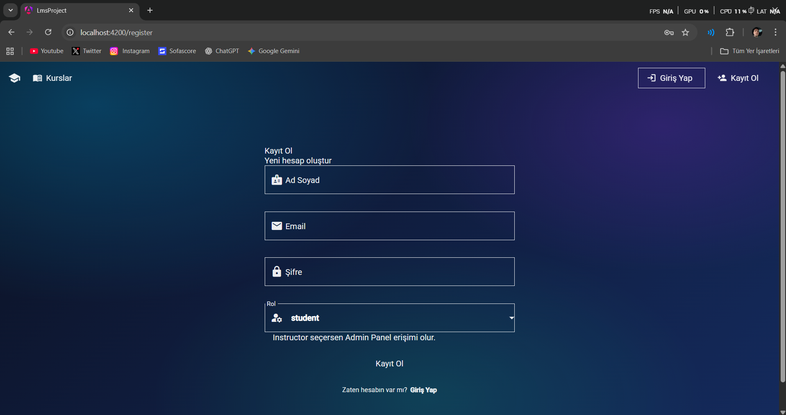
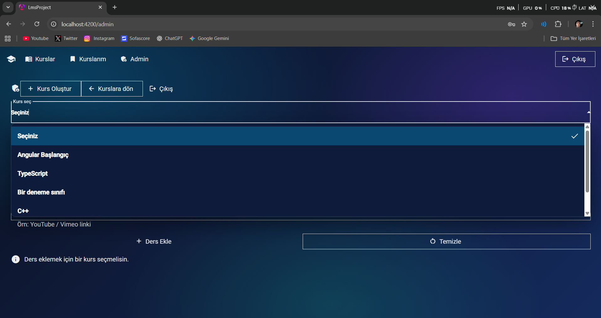
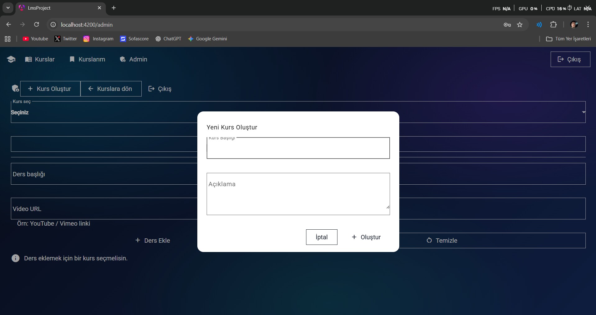

# Angular LMS Bitirme Projesi

Bu proje, **Angular** kullanılarak geliştirilmiş bir **Eğitim Yönetim Sistemi (LMS – Learning Management System)** uygulamasıdır.

Projede kullanıcılar kursları görüntüleyebilir, kurslara kayıt olabilir, dersleri izleyebilir ve yorum yapabilir.  
**Eğitmen (Admin)** rolündeki kullanıcılar ise kurs ve ders yönetimi işlemlerini gerçekleştirebilir.

---

## 🚀 Kullanılan Teknolojiler

- Angular
- Angular Material
- TypeScript
- JSON Server (Fake Backend)
- HTML / SCSS
- RxJS

---

## 👤 Kullanıcı Rolleri

### Student (Öğrenci)
- Kursları listeleyebilir
- Kursa kayıt olabilir
- Dersleri görüntüleyebilir
- Yorum yapabilir

### Instructor (Admin)
- Kurs oluşturabilir
- Kurs silebilir
- Kursa ders ekleyebilir
- Ders silebilir

---

## 🔐 Örnek Kullanıcı Hesapları

### Öğrenci
- Email: `ahmet@example.com`
- Şifre: `1234`
- Rol: `student`

### Eğitmen (Admin)
- Email: `ayse@example.com`
- Şifre: `abcd`
- Rol: `instructor`

---

## ⚙️ Kurulum ve Çalıştırma

### 1️⃣ Backend (JSON Server)

```bash
npm install -g json-server
json-server --watch db.json --port 3000

2️⃣ Frontend (Angular)

npm install
ng serve

Tarayıcıdan aç:

http://localhost:4200


## 📸 Ekran Görüntüleri

### 🔐 Giriş Ekranı (Login)



### 📚 Kurs Listesi (Öğrenci Hesabı)


### 📖 Kurs Detay Sayfası (Öğrenci)


### 📝 Kayıt Ol Sayfası (Register)


### 🛠️ Admin Panel – Kurs Ekleme


### 📂 Admin Panel – Kurs İçeriği


---

## 👨‍💻 Geliştirici

**Mustafa Ulu**  
Angular LMS Bitirme Projesi – 2025
