# ANGULAR20-LMS-BITIRMEPROJESI

## 📌 Project Overview

**ANGULAR20-LMS** is a modern **Learning Management System (LMS)** platform built with **Angular 20**, leveraging the latest framework features to deliver optimal performance and user experience.
This project demonstrates **advanced Angular development practices** with a focus on **performance optimization** and **scalable architecture**.

---

## 🚀 Performance Optimization Strategies

### 🔧 Advanced Angular Techniques Implemented

- ⚡ **Lazy Loading**: Feature-based code splitting for faster initial load times
- 🔮 **Angular Signals**: Reactive state management for optimal change detection
- 🎯 **OnPush Change Detection**: Strategic implementation for minimized change detection cycles

---

## 📝 Form Management Strategy

- **Template-Driven Forms** → Used for simple forms (Login)
- **Reactive Forms** → Implemented for complex forms (Registration, Course Creation, Course Edit) with advanced validation

---

## 🔐 Authentication & Authorization

### 🔒 Security Implementation

- **JSON-Server-Auth**: Backend authentication system for user management
- **Token-Based Authentication**: JWT tokens for secure API communication
- **Role-Based Access Control**: Distinct permissions for different user types

### 👥 User Roles

- 👨‍🎓 **Student**: Course browsing, enrollment, and learning management
- 👨‍🏫 **Instructor**: Course creation and management

---

## 🏗️ Technical Architecture

### 💻 Frontend

- **Angular 20** → Latest version with modern features
- **TypeScript** → Full-stack type safety
- **Bootstrap/CSS** → UI design system
- **Angular Router** → Advanced routing with guards and lazy loading

### 🔗 Backend Integration
- **Mock REST API** → Provided by `json-server` and `json-server-auth`
- **HTTP Interceptors** → Centralized API request/response handling (JWT token injection), Check token validation(expiration date)

## ScreenShots

### Navbar

Different navbar states based on authentication status

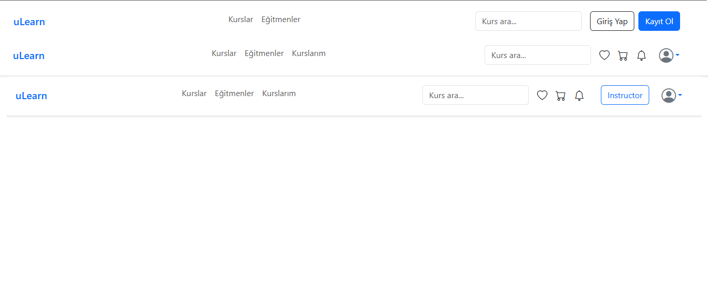

### Register Page

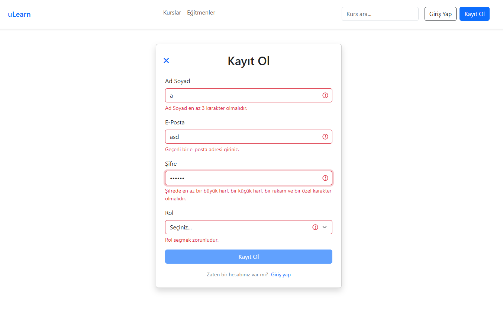

### Login Page

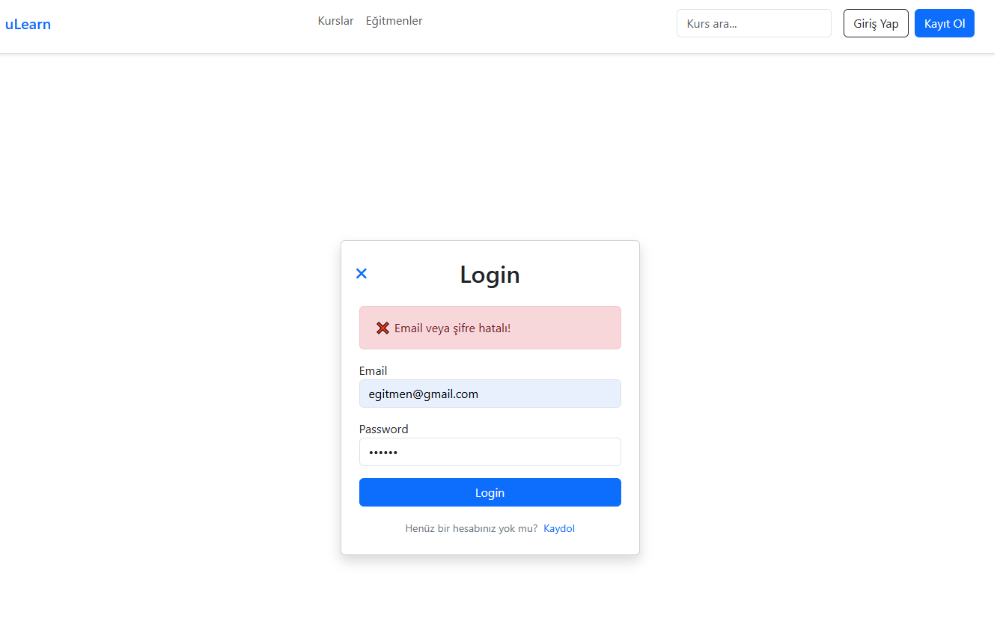

### Course Detail Page (Anonymous-1)

Non-logged-in users can access the course detail page; however, they are restricted from watching lessons, enrolling, or leaving comments.

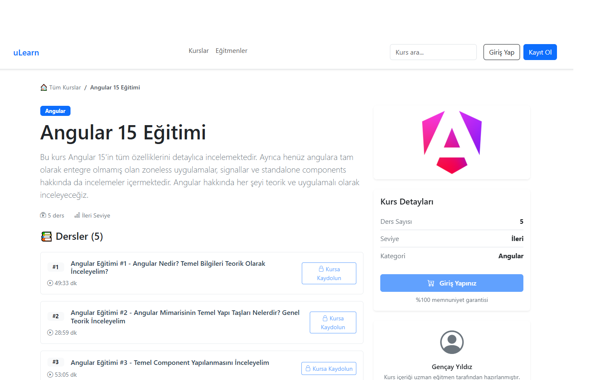

### Course Detail Page (Anonymous-2)

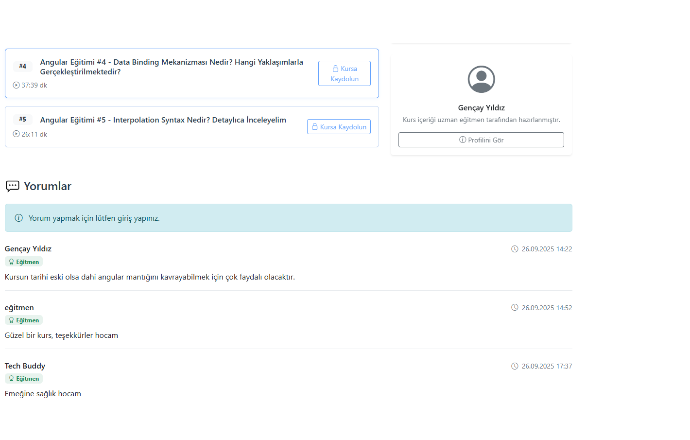

### Course Detail Page (Logged-in)

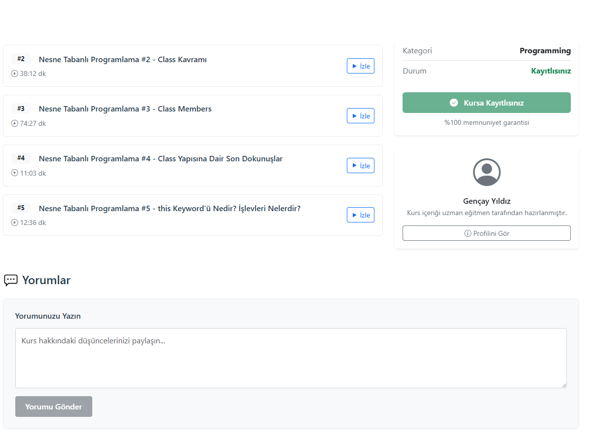

### Course Detail Page (Non-Enrolled)

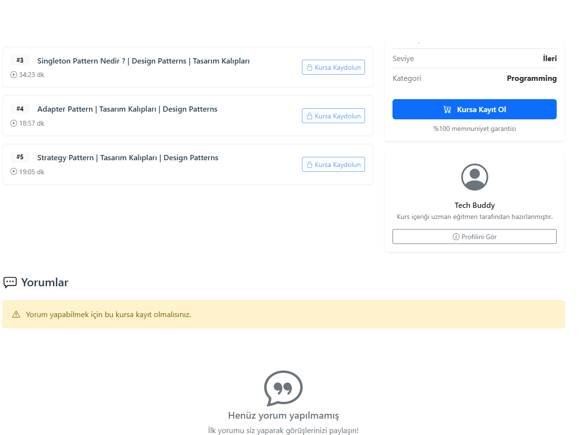

### Instructor Page

To access the Instructor Page, the user must have the instructor role.

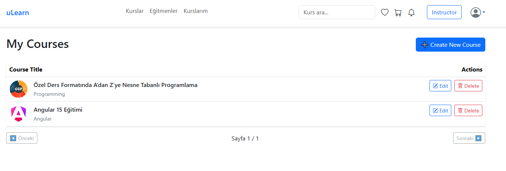

### Create New Course Page

To access the new course creation page, the user must have the instructor role.

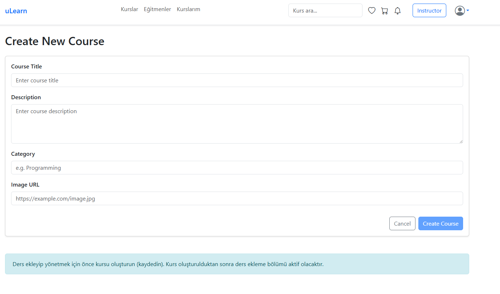

### Course Editing Page-1

To access the course editing page, the user must have the instructor role.

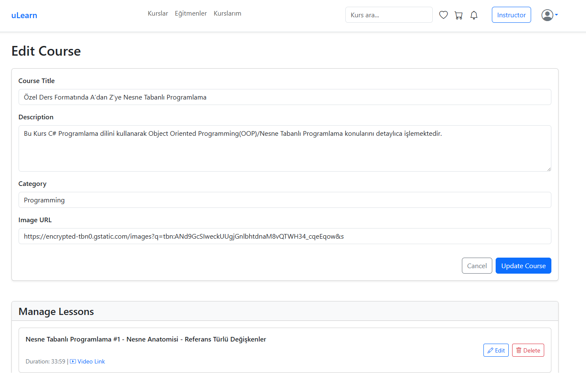

### Course Editing Page-2

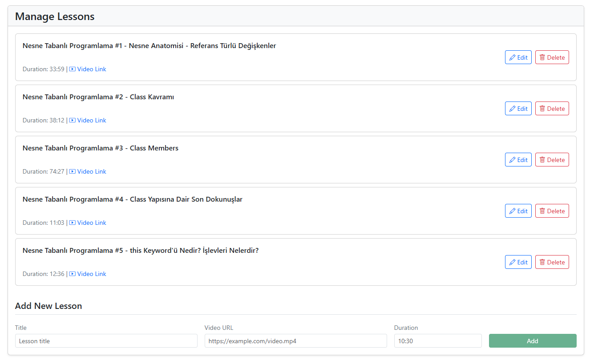

### Courses Page

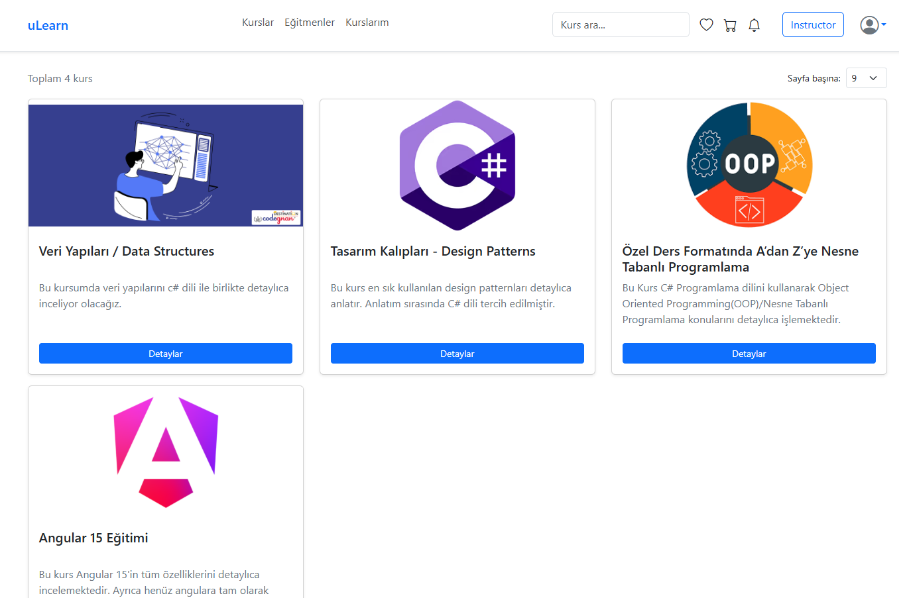

### My-Courses Page

This is the page where the courses a user has enrolled in are listed. To access this page, the user must be logged in. It is available to both student and instructor roles.

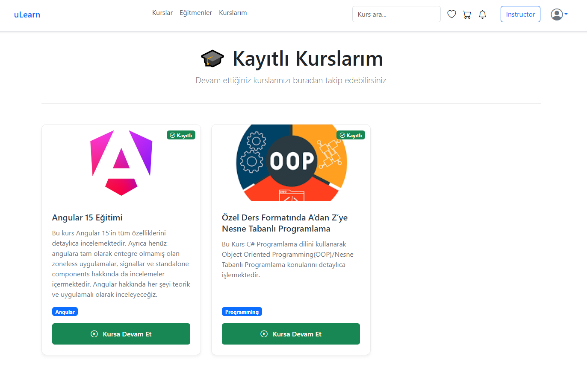

### Our-Instructor Page

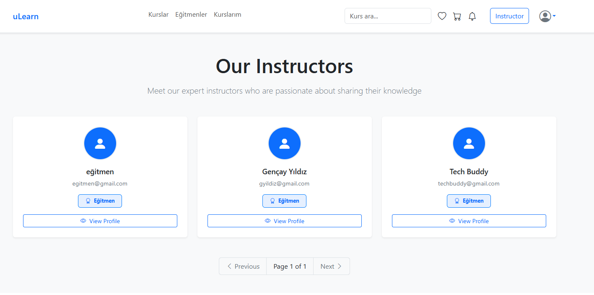

### Instructor Profile Page

This page lists the courses created by the instructor.

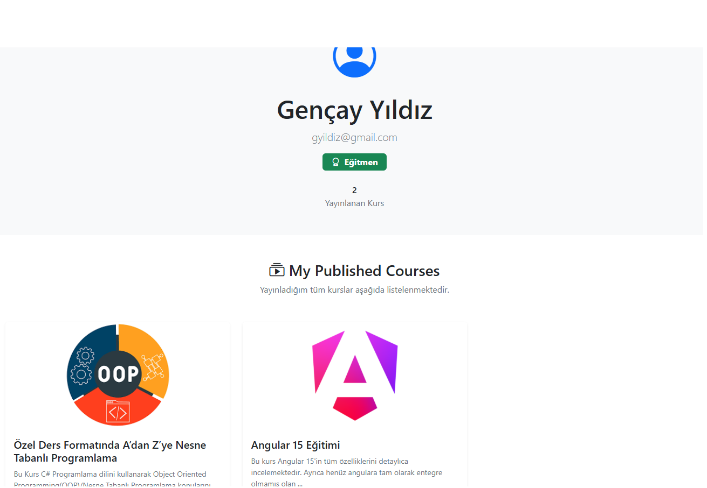

### Öğrenci Profili Sayfası

This page lists the courses enrolled by the student.

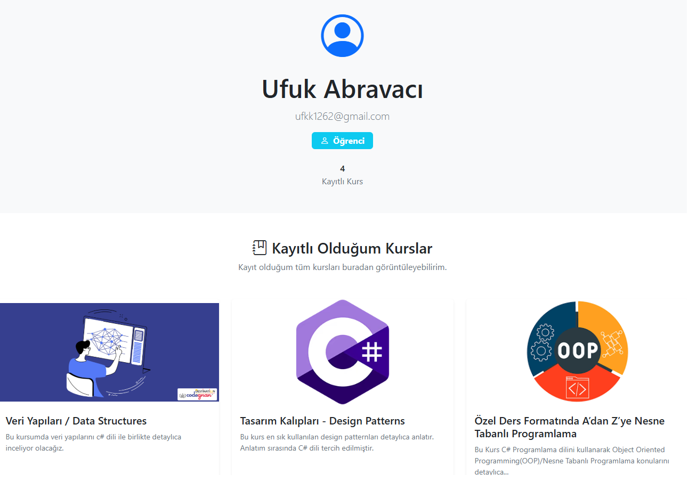
