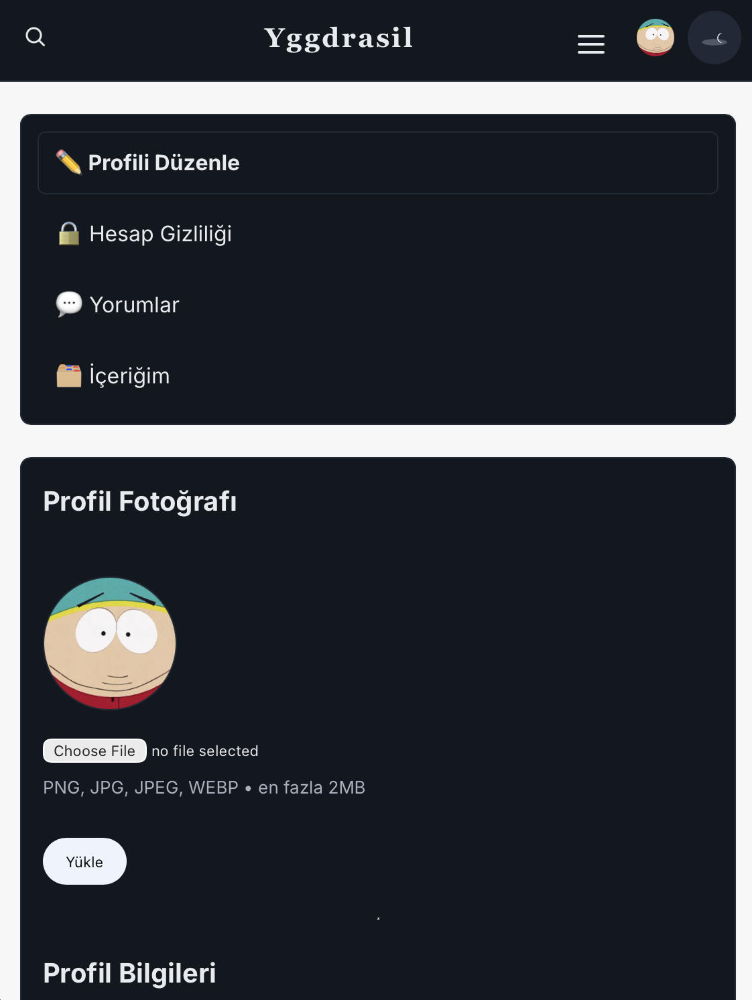
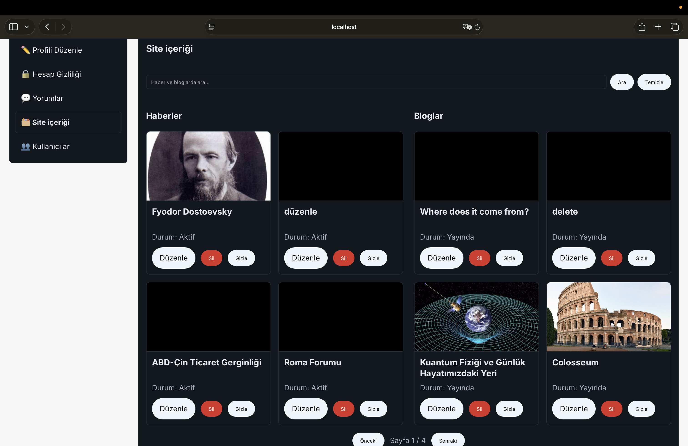
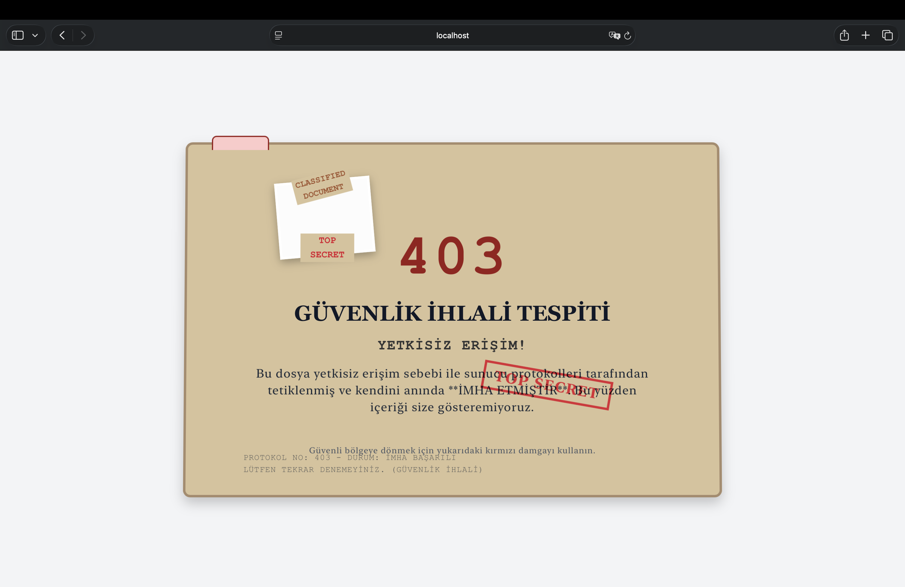
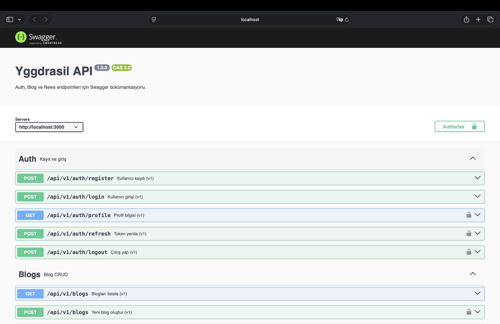

# Yggdrasil

Bu proje, Express + EJS + MongoDB + TypeScript ile geliştirilmiş bir içerik platformudur. JWT tabanlı API ve session tabanlı web arayüzü ile kullanıcı yönetimi, blog ve haber içerikleri, yorumlar, kategoriler ve admin yetkilerini içerir.

---

### Kullanılan Teknolojiler

Bu proje aşağıdaki temel teknolojiler kullanılarak geliştirilmiştir:

- Node.js (Express.js)
- TypeScript
- EJS (Sunucu tarafı render)
- MongoDB (Mongoose)
- Multer (dosya yükleme)
- express-validator (doğrulama)
- JWT + express-session (kimlik doğrulama)
- Swagger UI (API dokümantasyonu)

---

### Gereksinimler

Projenin başarıyla kurulup çalıştırılması için sisteminizde aşağıdaki yazılımların yüklü olması gerekmektedir:

- Node.js (v18+ önerilir)
- npm
- Çalışan bir MongoDB instance (lokal veya bulut)
- (Opsiyonel) Nodemon veya ts-node-dev ile hot-reload için geliştirme ortamı

Çevresel değişkenler (`.env`) — minimum önerilen yapı:

- `MONGO_URI` ve `JWT_SECRET` zorunludur; eksik olduğunda uygulama hata verir.
- `SESSION_SECRET` web oturumları için önerilir.
- `PORT` isteğe göre ayarlanabilir.
- `ADMIN_EMAIL` ve `ADMIN_PASSWORD` tanımlanırsa başlangıçta bu bilgilerle admin oluşturulur; aksi halde varsayılan değerler kullanılır.

---

### Kurulum ve Başlatma

1. Gerekli tüm Node modüllerini yükleyin:
   ```bash
   npm install
   ```
2. Geliştirme modunda başlatın (hot-reload için iki alternatif):
   ```bash
   npm run dev
   ```
   veya
   ```bash
   npm run dev:nodemon
   ```

> **Uyarı**: Varsayılan port `3000`’dir (`PORT` ile değiştirilebilir). Port dolu ise sunucu otomatik olarak bir üst porta (ör. `3001`) geçmeyi dener.

Üretim için:
```bash
npm run build
```
```bash
npm start
```

---

### Uygulama URL’leri

- Web Arayüzü (EJS): `http://localhost:<PORT>/`
- Bloglar: `http://localhost:<PORT>/blogs`
- Haberler: `http://localhost:<PORT>/news`
- Profil: `http://localhost:<PORT>/auth/profile`
- Swagger (API dokümantasyonu): `http://localhost:<PORT>/api-docs`

---

### API (Özet)

Base path: `/api`

- Auth
  - `POST /v1/auth/register` — Kayıt
  - `POST /v1/auth/login` — Giriş (JWT döner)
  - `GET  /v1/auth/profile` — Profil (JWT)
  - `POST /v1/auth/refresh` — Token yenile (JWT)
  - `POST /v1/auth/logout` — Çıkış (JWT)
- Profile (JWT)
  - `GET    /v1/profile` — Profilimi getir
  - `PUT    /v1/profile` — Bilgi güncelle
  - `POST   /v1/profile/password` — Şifre değiştir
  - `POST   /v1/profile/picture` — Avatar yükle
  - `DELETE /v1/profile` — Hesabı sil
- Blogs
  - `GET    /v1/blogs` — Listele
  - `GET    /v1/blogs/:id` — Tekil
  - `POST   /v1/blogs` — Oluştur (JWT)
  - `PUT    /v1/blogs/:id` — Güncelle (JWT)
  - `DELETE /v1/blogs/:id` — Sil (JWT)
  - `POST   /v1/blogs/:id/like|dislike` — Reaksiyon
- News
  - `GET    /v1/news` — Listele
  - `GET    /v1/news/:id` — Tekil
  - `POST   /v1/news` — Oluştur (JWT + yetki)
  - `PUT    /v1/news/:id` — Güncelle (JWT + yetki)
  - `DELETE /v1/news/:id` — Sil (JWT + yetki)
  - `POST   /v1/news/:id/like|dislike` — Reaksiyon
- Comments (JWT)
  - `GET    /v1/blogs/:id/comments` — Blog yorumları
  - `GET    /v1/news/:id/comments` — Haber yorumları
  - `POST   /v1/comments` — Oluştur
  - `PUT    /v1/comments/:id` — Güncelle
  - `DELETE /v1/comments/:id` — Sil
- Categories
  - `GET    /v1/categories` — Listele
  - `GET    /v1/categories/:id` — Tekil
  - `POST   /v1/categories` — Oluştur (JWT + admin)
- Search
  - `GET /v1/search/blogs?q=...` — Blog arama
  - `GET /v1/search/news?q=...` — Haber arama

Detaylı tanımlar ve deneme için Swagger’ı kullanın: `/api-docs`.

---

### Doğrulama ve Güvenlik

- Sunucu tarafı doğrulama: `express-validator` zincirleri (ör. register, blog/news create/update, comments)
- JWT (API) + session (web); token süresi varsayılan `1h`
- Yorum içerikleri ve form’larda istemci tarafı min/max kontroller
- Dosya yükleme (`avatar`) için `multer` ile boyut ve dosya türü kontrolü
- Mass Assignment koruması (register):
  - Whitelisting: `registerUser()` yalnızca `email`, `password`, `name` alanlarını kabul eder ve `roles` değeri server tarafından zorunlu olarak `['user']` atanır. İstemciden gelen `roles` gibi ayrıcalıklı alanlar işlenmez. (Bkz. `src/services/authService.ts`)
  - Validation blokları: `authRegisterRules` içinde `createdAt` ve `updatedAt` gönderimi açıkça engellenir. (Bkz. `src/middleware/ValidationChainsExpress.ts`)
  - Şema kısıtları: `userModel`’da `createdAt` alanı `immutable` yapılarak kayıt sonrası değiştirilemez; roller `enum` ile sınırlıdır ve varsayılan `['user']` olarak tanımlanır. (Bkz. `src/models/userModel.ts`)
  - Rol yönetimi: Roller yalnızca admin yetkili endpoint’ler üzerinden güncellenebilir ve `authorizeRoles('admin')` ile korunur; gelen roller `['user','author','admin']` kümesine sanitize edilir. (Bkz. `src/controllers/restControllers/apiAdminController.ts`)

---

---

### Uygulama Ekran Görüntüleri
Aşağıda uygulamanın farklı bölümlerine ait örnek ekran görüntülerini ekleyebilirsiniz. Görselleri `./images/` klasörüne koyup README’de referanslayın.

#### Ana Sayfa
Platformun giriş sayfası ve gezinme menüsü.


#### Profil Düzenleme
Kişisel bilgiler, şifre değişimi ve avatar yükleme.
(küçük ekranda, responsive)


#### Profil Paneli İçine Entegre Yönetici Paneli
Yönetici (Admin), kendi profil sayfasından kullanıcıları ve site içeriğini yönetebilir.


#### 403
Erişim reddedildi sayfası.

---

### Test

Jest ve Supertest ile temel testler:
```bash
npm test
```

---

### Katkı ve Lisans

- Katkılar PR ve issue’lar üzerinden memnuniyetle kabul edilir.
- Lisans: ISC (`package.json`).


### Swagger (API Dokümantasyonu)
Swagger UI üzerinden API uç noktalarını keşfedip deneyebilirsiniz.
- Adres: `http://localhost:<PORT>/api-docs`
- Güvenlik: `Authorize` düğmesine tıklayıp JWT access tokenınızı girin (Bearer).
- Sunucu URL’i: `.env` `PORT` değerine göre ayarlanır (bkz. `src/config/swagger/base.ts`).
- Token alma: `POST /api/v1/auth/login` ile giriş yaptıktan sonra dönen `token`’ı kullanın.

