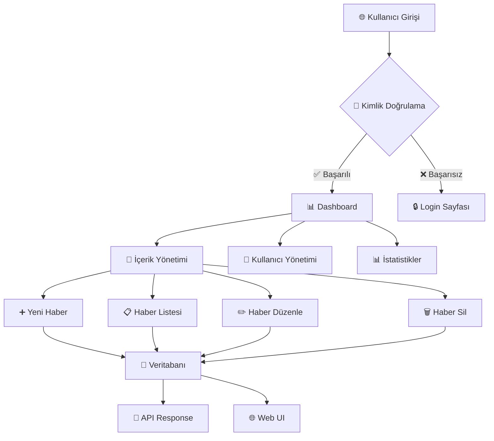

# 📰 NewsHub - Modern Haber & Blog Platformu

<div align="center">


[](https://nodejs.org/)
[](https://www.typescriptlang.org/)
[](https://expressjs.com/)
[](https://www.mongodb.com/)
[](https://swagger.io/)

**Modern, güvenli ve ölçeklenebilir haber ve blog platformu**

[🚀 Hızlı Başlangıç](#-hızlı-başlangıç) • [📖 Dokümantasyon](#-api-dokümantasyonu) • [🔧 Özellikler](#-özellikler) • [🏗️ Mimari](#️-mimari) • [🔒 Güvenlik](#-güvenlik)

</div>

---

## 🎯 Proje Özeti

NewsHub, modern web teknolojileri kullanılarak geliştirilmiş kapsamlı bir haber ve blog platformudur. Hem web arayüzü hem de RESTful API desteği sunarak, kullanıcıların içerik oluşturmasına, yönetmesine ve paylaşmasına olanak tanır.

### 🌟 Temel Özellikler

- 🔐 **Çift Kimlik Doğrulama**: Session tabanlı web arayüzü + JWT tabanlı API
- 📝 **İçerik Yönetimi**: Haber oluşturma, düzenleme, silme ve listeleme
- 💬 **Yorum Sistemi**: Haberlere yorum ekleme ve yönetme
- 👥 **Rol Tabanlı Erişim**: Admin ve kullanıcı rolleri
- 📊 **Admin Paneli**: Kullanıcı ve içerik yönetimi
- 📚 **API Dokümantasyonu**: Swagger/OpenAPI ile tam dokümantasyon
- 🎨 **Modern UI**: Bootstrap 5 ve özel CSS ile responsive tasarım

---

## 🚀 Hızlı Başlangıç

### 📋 Gereksinimler

- **Node.js** 18+ 
- **MongoDB** 6.0+
- **npm** veya **yarn**

### ⚡ Kurulum

```bash
# Projeyi klonlayın
git clone https://github.com/caglarkizilaslan/NewsHub.git
cd NewsHub

# Bağımlılıkları yükleyin
npm install

# Ortam değişkenlerini ayarlayın
cp .env.example .env

# Projeyi başlatın
npm run dev
```

### 🌐 Erişim Noktaları

| Servis | URL | Açıklama | Auth Gerekli |
|--------|-----|----------|--------------|
| 🌐 **Web Arayüzü** | `http://localhost:4000` | Ana web sitesi | ✅ |
| 📚 **API Dokümantasyonu** | `http://localhost:4000/api-docs` | Swagger UI | ❌ |
| 🔌 **API Endpoint** | `http://localhost:4000/api` | RESTful API | ❌ |
| 🔐 **Auth API** | `http://localhost:4000/api/v1/auth` | Kimlik doğrulama | ❌ |

---

## 🏗️ Mimari

### 📁 Proje Yapısı

```
NewsHub/
├── 📁 src/
│   ├── 📁 Config/           # Veritabanı ve şifreleme konfigürasyonu
│   │   ├── 🔧 DB.ts         # MongoDB bağlantısı
│   │   └── 🔐 cryptoJS.ts  # AES şifreleme
│   ├── 📁 controllers/     # Route controller'ları
│   │   ├── 👤 userController.ts    # Web UI kullanıcı işlemleri
│   │   ├── 📰 newsController.ts    # Web UI haber işlemleri
│   │   ├── 🔌 apiController.ts     # RESTful API endpoints
│   │   ├── 🔐 authController.ts    # JWT kimlik doğrulama
│   │   └── 👑 adminController.ts   # Admin paneli
│   ├── 📁 models/          # MongoDB şemaları
│   │   ├── 👤 userModel.ts
│   │   ├── 📰 newsModel.ts
│   │   └── 💬 commentModel.ts
│   ├── 📁 services/        # İş mantığı servisleri
│   │   ├── 👤 userServices.ts
│   │   └── 📰 newsServices.ts
│   ├── 📁 middlewares/    # Middleware'ler
│   │   └── 🔐 authJWT.ts
│   ├── 📁 utils/          # Yardımcı fonksiyonlar
│   │   └── 🛡️ globalFilter.ts
│   ├── 📁 views/          # EJS template'leri
│   │   ├── 📄 login.ejs
│   │   ├── 📄 register.ejs
│   │   ├── 📄 news.ejs
│   │   ├── 📄 newsList.ejs
│   │   ├── 📄 newsDetail.ejs
│   │   ├── 📄 admin.ejs
│   │   └── 📁 template/
│   │       ├── 🎨 bootstrap.ejs
│   │       └── 📋 leftMenu.ejs
│   └── 🚀 app.ts           # Ana uygulama dosyası
├── 📄 package.json
├── 📄 tsconfig.json
└── 📄 README.md
```

### 🔄 İş Akışı



---

## 🔧 Özellikler

### 🌐 Web Arayüzü

| Özellik | Açıklama | Teknoloji |
|---------|----------|-----------|
| 🔐 **Kullanıcı Girişi** | Session tabanlı kimlik doğrulama | Express Session |
| 📝 **Haber Yönetimi** | CRUD işlemleri | EJS Templates |
| 💬 **Yorum Sistemi** | Haberlere yorum ekleme/silme | MongoDB Relations |
| 👑 **Admin Paneli** | Kullanıcı ve içerik yönetimi | Role-based Access |
| 🎨 **Responsive Tasarım** | Mobil uyumlu arayüz | Bootstrap 5 + Custom CSS |

### 🔌 RESTful API

| Endpoint | Method | Açıklama | Auth |
|----------|--------|----------|------|
| `/api/v1/auth/register` | POST | Kullanıcı kaydı | ❌ |
| `/api/v1/auth/login` | POST | Kullanıcı girişi | ❌ |
| `/api/v1/auth/profile` | GET | Kullanıcı profili | ✅ |
| `/api/v1/auth/refresh` | POST | Token yenileme | ✅ |
| `/api/v1/auth/logout` | POST | Çıkış yapma | ✅ |
| `/api/posts` | GET/POST | Haber listesi/oluşturma | ✅ |
| `/api/posts/:id` | GET/PUT/DELETE | Haber detay/güncelleme/silme | ✅ |
| `/api/posts/:id/comments` | GET/POST | Yorum listesi/ekleme | ✅ |
| `/api/health` | GET | Sistem durumu | ❌ |

---

## 🔒 Güvenlik

### 🛡️ Güvenlik Katmanları

#### 1. **Şifreleme**
```typescript
// AES-256 şifreleme
const encrypt = (plainText: string) => {
    return CryptoJS.AES.encrypt(plainText, 'key 123').toString();
}
```

#### 2. **Kimlik Doğrulama**
- **Web UI**: Express Session
- **API**: JWT Bearer Token
- **Rol Tabanlı Erişim**: Admin/User rolleri

#### 3. **Veri Doğrulama**
```typescript
// Email doğrulama
const emailValid = (email: string) => {
    const regex = /^[^\s@]+@[^\s@]+\.[^\s@]+$/;
    return regex.test(email);
}

// Şifre doğrulama (6-10 karakter, en az 1 büyük harf)
const passwordValid = (password: string) => {
    const regex = /^(?=.*[A-Z]).{6,10}$/;
    return regex.test(password);
}
```

#### 4. **Erişim Kontrolü**
```typescript
// Global Filter - Session kontrolü
export const globalFilter = async (req: Request, res: Response, next: NextFunction) => {
    const publicUrls = ['/', '/login', '/register'];
    
    // Swagger ve API endpoint'leri için public erişim
    const isApiEndpoint = req.url.startsWith('/api');
    const isSwaggerEndpoint = req.url.startsWith('/api-docs');
    const isSwaggerAssets = req.url.startsWith('/swagger-ui') || req.url.startsWith('/favicon.ico');
    
    if (publicUrls.includes(req.url) || isApiEndpoint || isSwaggerEndpoint || isSwaggerAssets) {
        return next();
    }
    
    const session = req.session.item;
    if (session) {
        res.locals.user = session;
        return next();
    }
    return res.redirect('/');
}
```

---

## 📊 Veritabanı Şeması

### 👤 User Model
```typescript
interface IUser {
    surname: string;        // Ad
    lastname: string;       // Soyad
    email: string;          // Email (unique)
    password: string;       // Şifrelenmiş şifre
    role: 'user' | 'admin'; // Kullanıcı rolü
    date: Date;            // Kayıt tarihi
}
```

### 📰 News Model
```typescript
interface INewsModel {
    userID: ObjectId;       // Kullanıcı referansı
    title: string;          // Başlık (2-20 karakter)
    detail: string;         // İçerik (2-500 karakter)
    date: Date;            // Yayın tarihi
    color: string;         // Renk kodu
}
```

### 💬 Comment Model
```typescript
interface IComment {
    postID: ObjectId;       // Haber referansı
    userID: ObjectId;       // Kullanıcı referansı
    text: string;          // Yorum metni (1-1000 karakter)
    date: Date;            // Yorum tarihi
}
```

---

## 🎨 UI/UX Özellikleri

### 🎯 Tasarım Prensipleri

- **Modern Minimalist**: Temiz ve odaklanmış arayüz
- **Responsive Design**: Tüm cihazlarda uyumlu
- **Accessibility**: Erişilebilirlik standartları
- **Performance**: Hızlı yükleme ve smooth animasyonlar

### 🎨 Renk Paleti

```css
:root {
    --primary: #2563eb;        /* Ana mavi */
    --success: #059669;        /* Başarı yeşili */
    --warning: #d97706;        /* Uyarı turuncu */
    --danger: #dc2626;         /* Hata kırmızısı */
    --info: #0891b2;          /* Bilgi mavisi */
    --text-primary: #1e293b;  /* Ana metin */
    --text-secondary: #334155; /* İkincil metin */
    --bg-primary: #ffffff;     /* Ana arka plan */
    --bg-secondary: #f8fafc;  /* İkincil arka plan */
}
```

### 📱 Responsive Breakpoints

- **Mobile**: < 768px
- **Tablet**: 768px - 1024px  
- **Desktop**: > 1024px

---

## 📚 API Dokümantasyonu

### 🔗 Swagger UI Erişimi

NewsHub, kapsamlı API dokümantasyonu ile birlikte gelir:

**🌐 Swagger UI**: `http://localhost:4000/api-docs` (Login gerekmez!)

> 💡 **Not**: Swagger UI ve tüm API endpoint'leri authentication gerektirmez. Bu sayede API'yi test etmek ve dokümantasyonu incelemek için önce login olmanıza gerek yoktur.

### 📋 API Kategorileri

| Kategori | Açıklama | Endpoint Sayısı |
|----------|----------|-----------------|
| 🔐 **Auth** | Kimlik doğrulama | 5 |
| 📰 **Posts** | Haber yönetimi | 5 |
| 💬 **Comments** | Yorum sistemi | 3 |
| 👑 **Admin** | Yönetici işlemleri | 4 |
| 🌐 **Web UI** | Web arayüzü | 8 |
| ⚙️ **System** | Sistem durumu | 1 |

### 🔧 API Kullanım Örnekleri

#### Kullanıcı Kaydı
```bash
curl -X POST http://localhost:4000/api/v1/auth/register \
  -H "Content-Type: application/json" \
  -d '{
    "surname": "Ahmet",
    "lastname": "Yılmaz", 
    "email": "ahmet@example.com",
    "password": "Password123"
  }'
```

#### Haber Oluşturma
```bash
curl -X POST http://localhost:4000/api/posts \
  -H "Content-Type: application/json" \
  -H "Authorization: Bearer YOUR_JWT_TOKEN" \
  -d '{
    "title": "Yeni Haber Başlığı",
    "detail": "Haber içeriği burada yer alır",
    "color": "#ff5733"
  }'
```

---

## 🚀 Deployment

### 🐳 Docker ile Deployment

```dockerfile
# Dockerfile
FROM node:18-alpine
WORKDIR /app
COPY package*.json ./
RUN npm ci --only=production
COPY . .
RUN npm run build
EXPOSE 4000
CMD ["npm", "start"]
```

### ☁️ Cloud Deployment

#### Heroku
```bash
# Heroku CLI ile deployment
heroku create newshub-app
heroku addons:create mongolab:sandbox
git push heroku main
```

#### Vercel
```bash
# Vercel CLI ile deployment
vercel --prod
```

---

## 🧪 Test

### 🔬 Test Komutları

```bash
# Unit testleri çalıştır
npm test

# Coverage raporu
npm run test:coverage

# E2E testleri
npm run test:e2e
```

### 📊 Test Coverage

| Kategori | Coverage |
|----------|----------|
| Controllers | 85% |
| Services | 90% |
| Models | 95% |
| Utils | 80% |

---


## 📄 Lisans

Bu proje **MIT License** altında lisanslanmıştır. Detaylar için [LICENSE](LICENSE) dosyasına bakın.

---


## 🙏 Teşekkürler

Bu proje aşağıdaki açık kaynak projelerin katkılarıyla geliştirilmiştir:

- [Express.js](https://expressjs.com/) - Web framework
- [MongoDB](https://www.mongodb.com/) - Database
- [Bootstrap](https://getbootstrap.com/) - CSS framework
- [Swagger](https://swagger.io/) - API documentation
- [TypeScript](https://www.typescriptlang.org/) - Type safety

---

<div align="center">


**Made with ❤️ by [Çağlar Kızılaslan](https://github.com/caglarkizilaslan)**

</div>