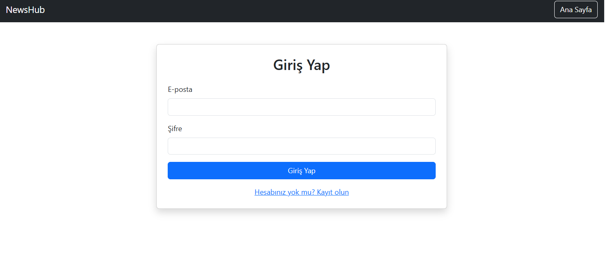
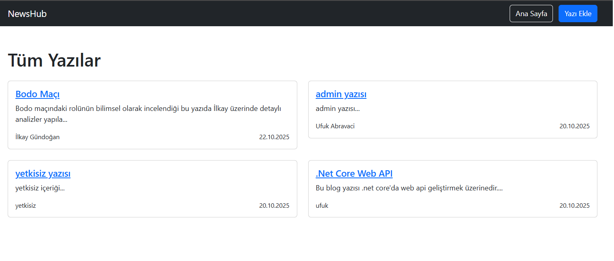
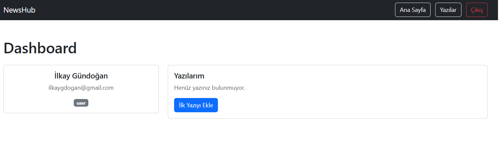
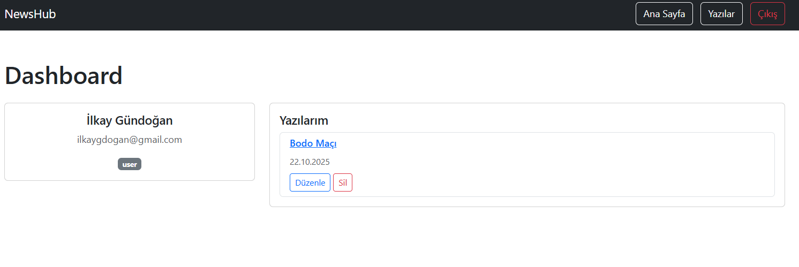
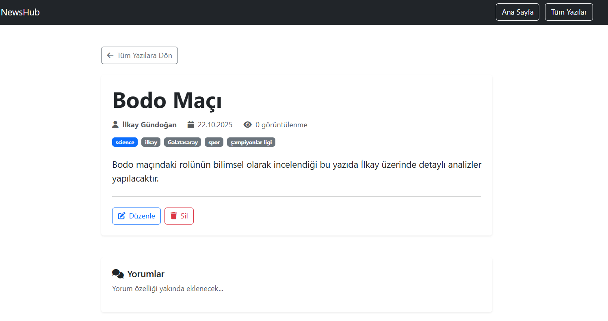
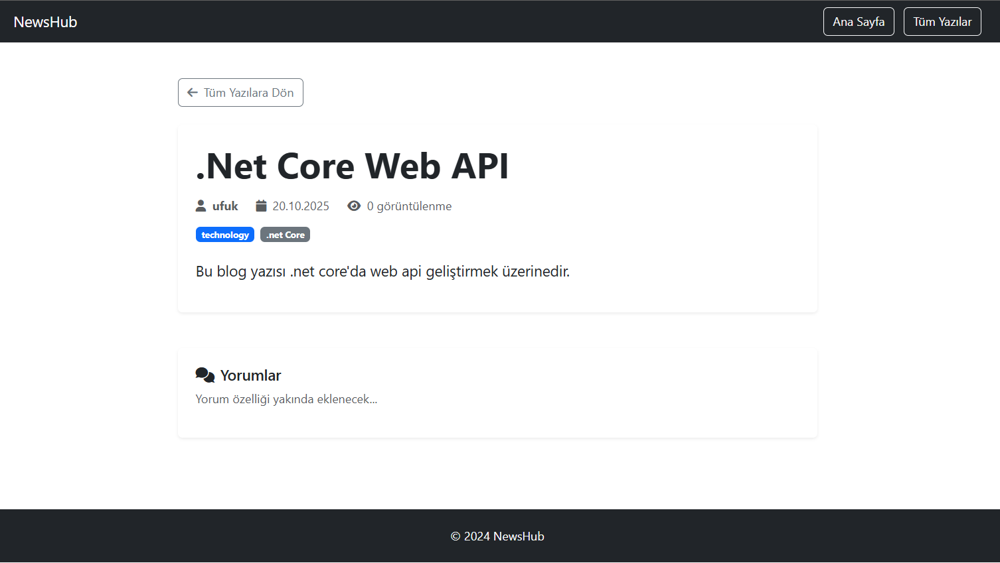
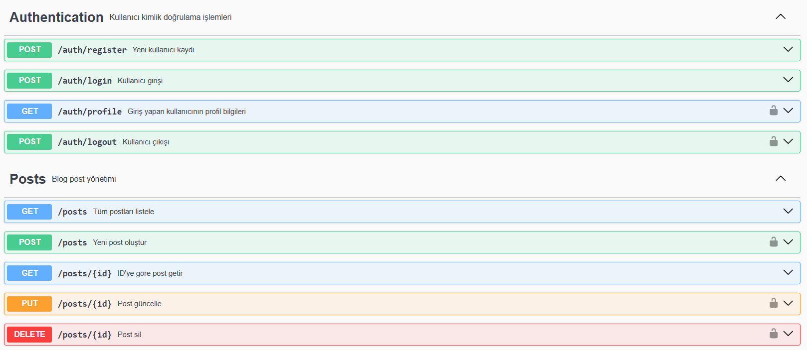
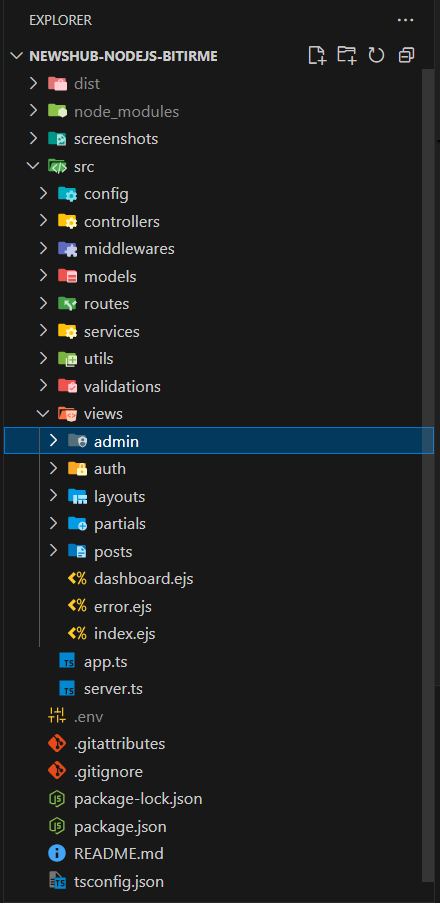

# NewsHub - Haber & Blog Platformu

Modern, full-stack haber ve blog platformu. Node.js, TypeScript, MongoDB ve Express.js kullanılarak geliştirilmiş, hem MVC hem REST API mimarisiyle inşa edilmiş profesyonel bir web uygulaması.

## 🚀 Teknolojiler

### Backend
- **Node.js** - Runtime environment
- **TypeScript** - Programlama dili
- **Express.js** - Web framework
- **MongoDB** - Veritabanı
- **Mongoose** - ODM
- **JWT** - API authentication
- **Express Session** - Web authentication
- **Joi** - Validation
- **bcryptjs** - Şifre hashleme

### Frontend
- **EJS** - Template engine
- **Bootstrap 5** - CSS framework
- **FontAwesome** - İkonlar

### Development
- **Swagger** - API dokümantasyonu
- **Nodemon** - Development server
- **dotenv** - Environment variables

## 📋 Özellikler

### 🔐 Authentication & Authorization
- Kullanıcı kaydı ve girişi
- Session tabanlı web authentication
- JWT tabanlı API authentication
- Rol tabanlı erişim kontrolü (Admin/User)

### 📝 Post Yönetimi
- Post oluşturma, düzenleme, silme
- Kategori ve etiket yönetimi
- Admin tüm postları yönetebilir
- User sadece kendi postlarını yönetebilir

### 🌐 Çok Katmanlı Mimari
- MVC pattern (EJS views)
- REST API endpoints
- Service layer business logic
- Repository pattern with Mongoose

## 🖼️ Ekran Görüntüleri

### Giriş Sayfası

*Kullanıcı giriş formu - Email ve şifre ile giriş yapılabilir*

### Kayıt Sayfası

*Yeni kullanıcı kayıt formu - İsim, email ve şifre ile kayıt olunabilir*

### Tüm Yazılar

*Tüm kullanıcıların paylaştığı postların listelendiği ana sayfa*

### Kullanıcı Dashboard'u

*Kullanıcı paneli - Kişisel bilgiler ve yazı yönetimi*

### Yazılı Dashboard

*Yazı eklenmiş kullanıcı paneli - Yazılar listeleniyor*

### Admin ve Yazı Sahibi Görünümü

*Post detay sayfası - Yazı sahibi ve admin düzenleme/silme butonlarını görür*

### Başka Kullanıcının Yazısı

*Başka kullanıcının yazısı - Normal kullanıcılar düzenleme/silme butonlarını görmez*

### API Dokümantasyonu

*Swagger UI - Tüm REST API endpoint'lerinin interaktif dokümantasyonu*

### 🏗️ Proje Yapısı

## 👥 Roller ve Yetkiler

### 🛡️ Admin (Yönetici)

**Yetkiler:**
- ✅ Tüm kullanıcıların postlarını görüntüleme
- ✅ Tüm postları düzenleyebilme (başka kullanıcıların postları dahil)
- ✅ Tüm postları silebilme (başka kullanıcıların postları dahil)
- ✅ Tüm kullanıcıları yönetebilme
- ✅ Kategori ve etiket yönetimi

**Uygulama İçinde Yapabildikleri:**
- Herhangi bir kullanıcının postuna gidip "Düzenle" butonunu görebilir
- Herhangi bir kullanıcının postunu silebilir
- Tüm postları görüntüleyebilir ve değiştirebilir

---

### 👤 User (Standart Kullanıcı)

**Yetkiler:**
- ✅ Kendi postlarını oluşturma
- ✅ Sadece kendi postlarını düzenleyebilme
- ✅ Sadece kendi postlarını silebilme
- ✅ Diğer kullanıcıların postlarını salt okunur görüntüleme
- ✅ Profil yönetimi
- ❌ Başka kullanıcıların postlarını düzenleyemez
- ❌ Başka kullanıcıların postlarını silemez

**Uygulama İçinde Yapabildikleri:**
- Sadece kendi postlarında "Düzenle" ve "Sil" butonlarını görür
- Başka kullanıcıların postlarında bu butonları görmez
- Yeni post oluşturabilir
- Kendi dashboard'undan postlarını yönetebilir

Not: Bu proje eğitim amaçlı geliştirilmiştir.