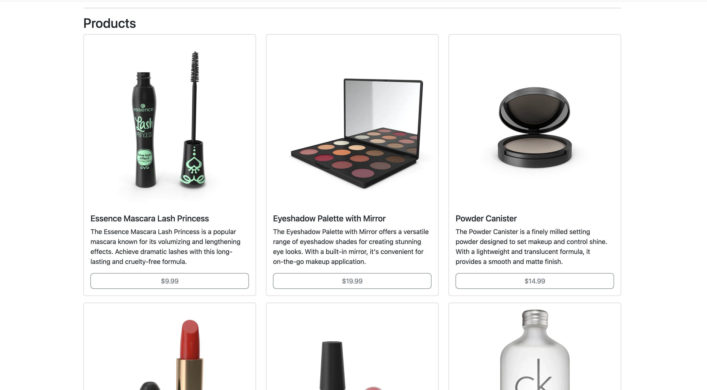
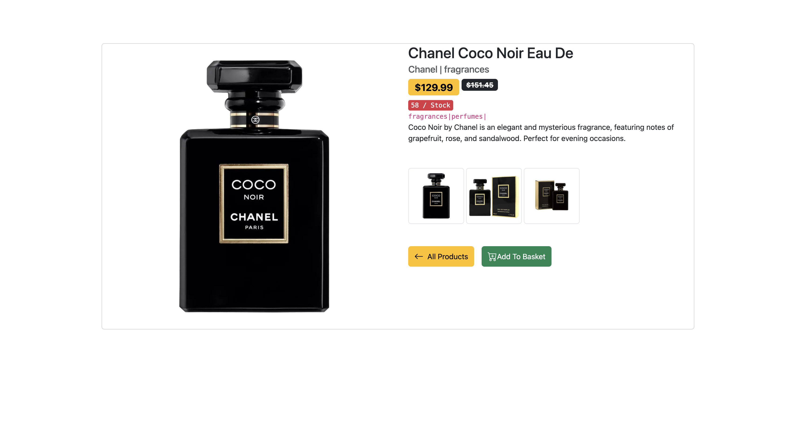
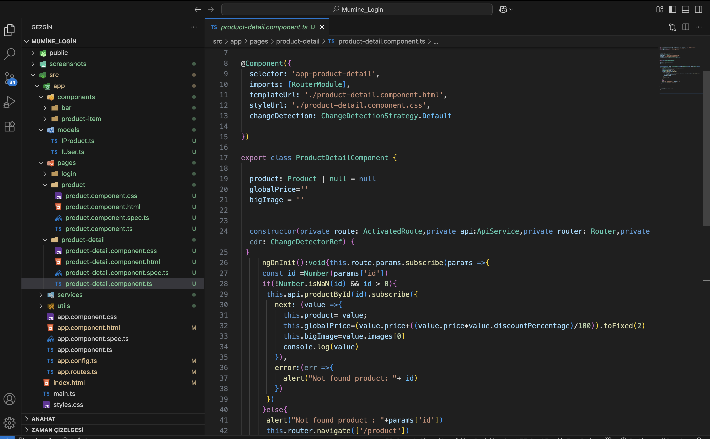

# 🛒 Angular Product Catalog App

Bu proje, **Angular** kullanılarak geliştirilmiş bir **ürün katalog uygulamasıdır**.
[DummyJSON API](https://dummyjson.com/products) üzerinden ürünler çekilmekte ve listelenmektedir.
Her ürün için **detay sayfası** da görüntülenebilir.

---

## 🎯 Proje Amacı

* API üzerinden ürünleri listelemek
* Her ürün için **resim**, **başlık** ve **fiyat** göstermek
* Seçilen ürünün detay sayfasında **ayrıntılı bilgileri** göstermek
* Angular ile **HTTP istekleri**, **routing** ve **component yapısını** uygulamak

---

## 🔧 Kullanılan Teknolojiler

* Angular 19.2.15
* TypeScript
* HTML & CSS
* DummyJSON API

---

## 🔗 API Kaynakları

* Ürün Listesi:

  ```url
  https://dummyjson.com/product
  ```
* Ürün Detayı:

  ```url
  https://dummyjson.com/product-detail/{id}
  ```

---

## 📸 Ekran Görüntüleri

### 🖼️ Product List



---

### 🖼️ Product Detail



---

### 🖼️ Proje Dosya Yapısı




## 🧭 Uygulama Özellikleri

### 🔹 Ürün Listesi Sayfası

* API'den alınan ürünler gösterilir.
* Her kartta:

  * Ürün görseli
  * Ürün başlığı
  * Fiyat

### 🔹 Detay Sayfası

* Resim
* Başlık
* Açıklama
* Fiyat
* Marka
* Kategori

---


## 🚀 Kurulum ve Çalıştırma

Projeyi yerel ortamında çalıştırmak için aşağıdaki adımları izle:

```bash
# 1. Projeyi klonla
git clone https://github.com/kullanici-adi/angular-product-catalog.git

# 2. Proje klasörüne gir
cd angular-product-catalog

# 3. Bağımlılıkları yükle
npm install

# 4. Uygulamayı çalıştır
ng serve
```

➡️ Tarayıcıdan `http://localhost:4200` adresine giderek projeyi görüntüleyebilirsin.
