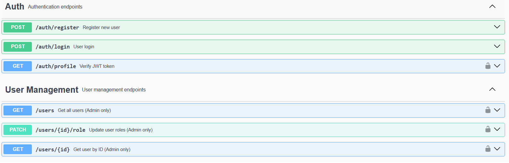
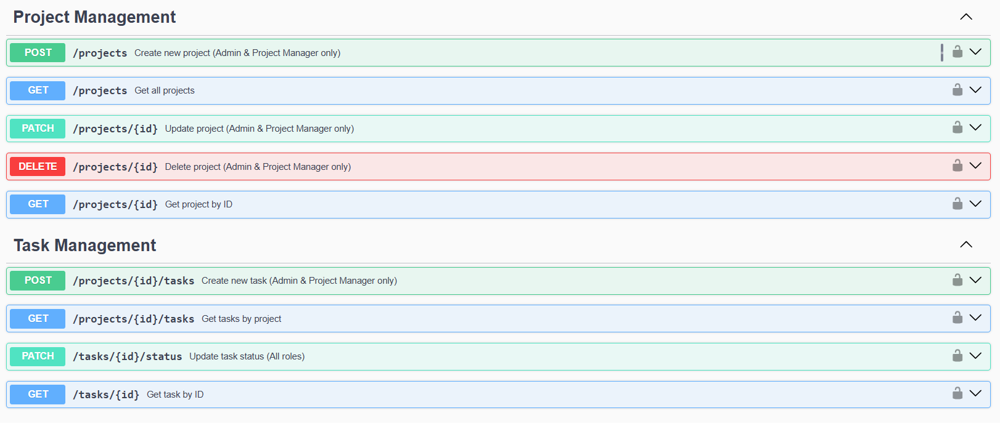

# TeamTask - Proje Yönetim ve Takip Sistemi

**TeamTask**, ekiplerin projelerini ve görevlerini verimli bir şekilde yönetebilmesi için geliştirilmiş, Node.js (Express) ve TypeScript tabanlı modern bir REST API uygulamasıdır. Rol tabanlı erişim kontrolü ile güvenli ve ölçeklenebilir bir proje yönetim çözümü sunar.

## 👥 Geliştirici Ekip

- **Ufuk Abravacı**
- **Haktan Erbaktı**
- **İsmail Sümer**
- **Mustafa Ulu**

## 🚀 Özellikler

- ✅ **JWT Kimlik Doğrulama** - Güvenli token tabanlı giriş sistemi
- ✅ **Rol Tabanlı Erişim Kontrolü** - Admin, Project Manager, Developer rolleri
- ✅ **Proje Yönetimi** - Proje oluşturma, güncelleme, silme, listeleme
- ✅ **Görev Yönetimi** - Görev ekleme, durum güncelleme, filtreleme
- ✅ **Kullanıcı Yönetimi** - Kullanıcı listeleme ve rol yönetimi
- ✅ **Swagger API Dokümantasyonu** - Kapsamlı ve interaktif API dokümantasyonu
- ✅ **MongoDB Veritabanı** - Mongoose ODM ile güvenli veri yönetimi
- ✅ **TypeScript Desteği** - Tip güvenliği ve geliştirici deneyimi
- ✅ **Modüler Mimari** - Controller-service-model yapısı ile temiz kod

## 🛠️ Kullanılan Teknolojiler

| Teknoloji | Açıklama |
|-----------|----------|
| **Node.js** | Sunucu tarafı JavaScript çalıştırma ortamı |
| **Express.js** | Hızlı ve minimalist web framework'ü |
| **TypeScript** | Tip güvenliği ve gelişmiş geliştirici deneyimi |
| **MongoDB** | NoSQL veritabanı sistemi |
| **Mongoose** | MongoDB object modeling için ODM kütüphanesi |
| **JWT** | JSON Web Token ile kimlik doğrulama |
| **CryptoJS** | Şifreleme ve hashleme işlemleri |
| **Swagger UI** | Otomatik API dokümantasyon arayüzü |

## 📋 API Endpoint'leri

### 🔐 Kimlik Doğrulama
- `POST /auth/register` - Yeni kullanıcı kaydı
- `POST /auth/login` - Kullanıcı girişi ve JWT token üretimi
- `GET /auth/profile` - Token doğrulama ve kullanıcı bilgileri

### 👥 Kullanıcı Yönetimi
- `GET /users` - Tüm kullanıcıları listele (Admin only)
- `GET /users/:id` - Kullanıcı detaylarını getir (Admin only)
- `PATCH /users/:id/role` - Kullanıcı rollerini güncelle (Admin only)

### 📦 Proje Yönetimi
- `POST /projects` - Yeni proje oluştur (Admin & Project Manager)
- `GET /projects` - Projeleri listele
- `GET /projects/:id` - Proje detaylarını getir
- `PATCH /projects/:id` - Proje bilgilerini güncelle (Admin & Project Manager)
- `DELETE /projects/:id` - Proje sil (Admin & Project Manager)

### ✅ Görev Yönetimi
- `POST /projects/:id/tasks` - Projeye yeni görev ekle (Admin & Project Manager)
- `GET /projects/:id/tasks` - Projedeki görevleri listele
- `GET /tasks/:id` - Görev detaylarını getir
- `PATCH /tasks/:id/status` - Görev durumunu güncelle

## 🖼️ API Arayüz Görüntüleri

